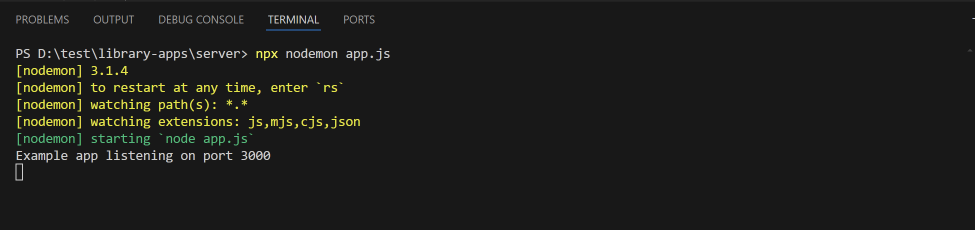
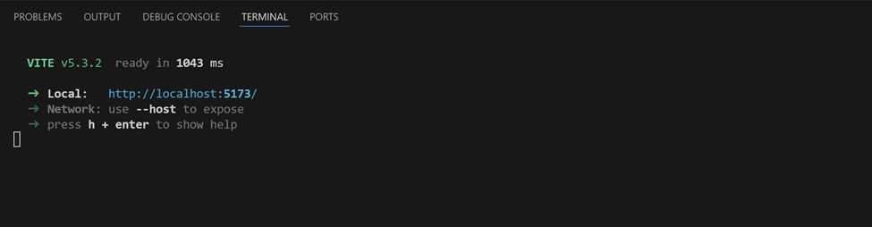

# library-apps

# Dokumentasi Running Code

## --- Server ---

1. Pada terminal, navigasikan ke direktori server dengan perintah __cd server__ :

2. Install semua dependencies dengan perintah __npm install__ :

3. Setelah proses instalasi selesai, jalankan server menggunakan command __npx nodemon app__ :

4. Server berhasil berjalan jika terminal menampilkan output seperti berikut:

## --- Client ---

1. Buka terminal baru, navigasikan ke direktori client perintah __cd server__:

2. Install semua dependencies dengan perintah __npm install__:

3. Setelah proses instalasi selesai, jalankan client menggunakan command __npm run dev__ :

4. Client berhasil berjalan jika terminal menampilkan output seperti berikut:

