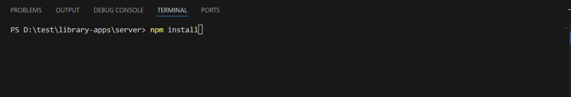

# library-apps

# Dokumentasi Running Code

## --- Server ---

1. Pada terminal, navigasikan ke direktori server:

2. Install semua dependencies dengan perintah *npm install*:

3. Setelah proses instalasi selesai, jalankan server menggunakan command *npx nodemon app* :

4. Server berhasil berjalan jika terminal menampilkan output seperti berikut:

## --- Client ---

1. Buka terminal baru, navigasikan ke direktori client:

2. Install semua dependencies dengan perintah *npm install*:

3. Setelah proses instalasi selesai, jalankan client menggunakan command *npm run dev* :

4. Client berhasil berjalan jika terminal menampilkan output seperti berikut:

